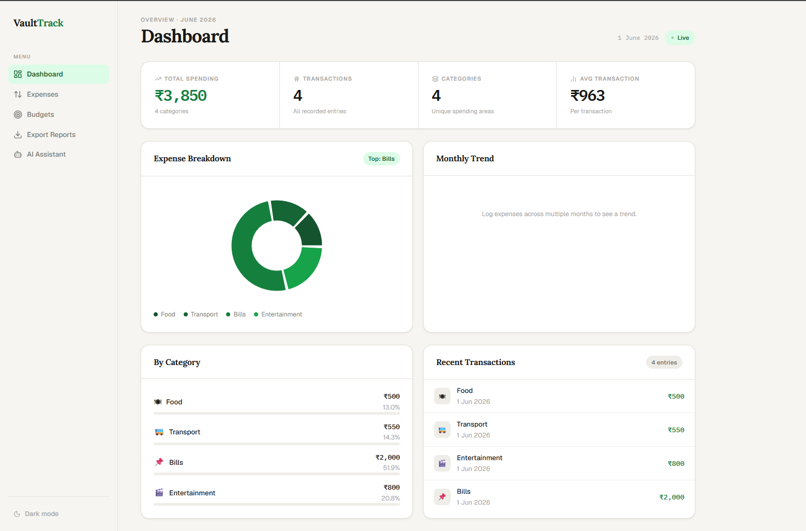
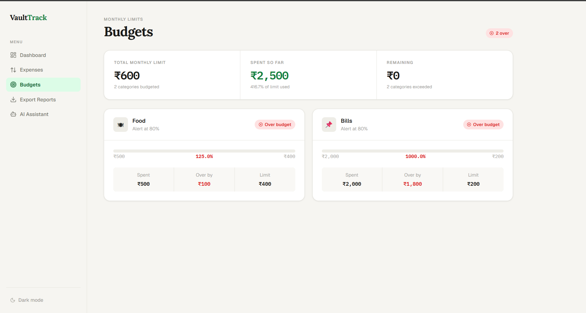
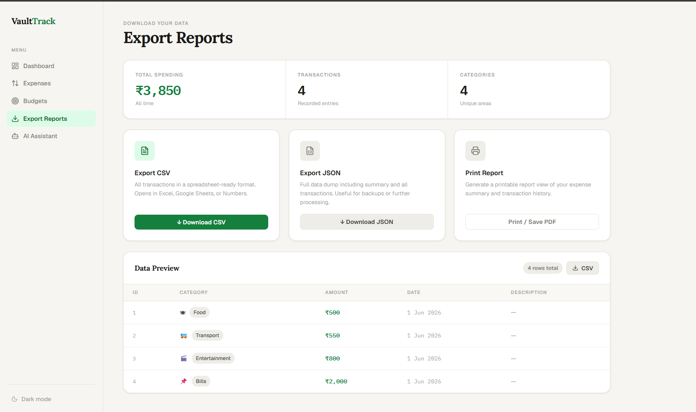
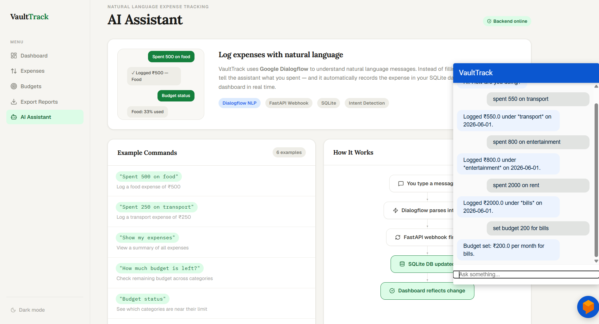
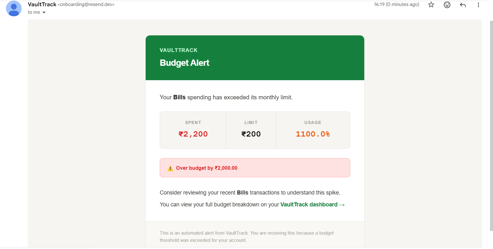

# VaultTrack 💰

**AI-Powered Personal Finance Dashboard with Natural Language Expense Tracking**


*Built with React, FastAPI, PostgreSQL (Supabase), Dialogflow NLP, and Resend Email API.*

VaultTrack is a full-stack personal finance application that combines analytics, budgeting, reporting, and natural-language expense tracking using Dialogflow NLP. Instead of manually filling out forms, users log expenses through conversational commands, which are processed by Dialogflow and stored through a FastAPI backend.

---

## 🚀 Live Demo

| | |
|---|---|
| **Frontend** | https://vault-track.vercel.app/ |
| **Backend API Docs** | https://vaulttrack-backend-r57g.onrender.com/docs |

---

## 📸 Screenshots

### Dashboard


### Budgets


### Export Reports


### AI Assistant


### Budget Alert Email


---

## 📌 Overview

Traditional expense trackers rely on forms and manual data entry. VaultTrack explores a different approach by integrating Natural Language Processing into personal finance management.

Users record expenses using simple conversational commands:

```text
Spent 500 on food
Spent 250 on transport
Show my expenses
How much budget is left?
Budget status
```

Dialogflow processes these requests, the FastAPI backend stores the transactions in PostgreSQL, and the React dashboard visualizes spending behavior in real time. When spending approaches or exceeds a budget threshold, the system automatically dispatches an HTML alert email via Resend.

---

## ✨ Features

### 🤖 Natural Language Expense Tracking
- Dialogflow-powered intent detection
- Conversational expense logging — no forms required
- FastAPI webhook integration
- Automated transaction processing

### 📊 Analytics Dashboard
- Total spending overview with animated counters
- Category-wise expense breakdown (pie + bar charts)
- Monthly spending trend line chart derived from transaction dates
- Recent transaction history
- Interactive visualizations using Recharts

### 💸 Budget Management
- Category-specific monthly budgets
- Real-time budget utilization tracking
- Remaining budget calculations
- Color-coded progress bars (green → orange → red)
- Over-budget and near-limit alerts

### 📧 Automated Email Alerts
- Triggered when spending crosses a category's alert threshold
- Professional HTML email template delivered via Resend API
- Inline fallback message in the chatbot if email delivery fails
- Configurable per-category alert thresholds

### 📄 Reporting & Exports
- Client-side CSV export
- Client-side JSON export
- Printable report generation
- Transaction data preview

### ☁️ Cloud Deployment
- Frontend deployed on Vercel
- Backend deployed on Render
- PostgreSQL database hosted on Supabase
- Public API documentation via FastAPI's auto-generated /docs
- CORS configured for cross-origin frontend/backend communication

---

## 🏗️ System Architecture

```text
User
 │
 ▼
Natural Language Input
 │
 ▼
Google Dialogflow NLP
(Intent & entity extraction)
 │
 ▼
FastAPI Webhook  ──────────────────────────────┐
 │                                             │
 ▼                                             ▼
Supabase PostgreSQL                   Resend Email API
(persistent cloud storage)            (budget alert emails)
 │
 ▼
Analytics & Budget Engine
 │
 ▼
React Dashboard
```

---

## 🛠️ Tech Stack

### Frontend
| Technology | Purpose |
|---|---|
| React + Vite | UI framework and build tool |
| React Router | Client-side routing |
| Axios | HTTP requests to backend |
| Recharts | Interactive charts |
| Lucide React | Icon system |

### Backend
| Technology | Purpose |
|---|---|
| FastAPI | REST API and webhook handler |
| PostgreSQL (Supabase) | Persistent relational storage |
| psycopg2 | PostgreSQL driver for Python |
| Dialogflow | NLP intent recognition |
| Resend | Transactional email delivery |
| Python | Backend runtime |

### Deployment
| Service | Role |
|---|---|
| Vercel | Frontend hosting |
| Render | Backend hosting |
| Supabase | PostgreSQL database |

---

## 📂 Project Structure

```text
VaultTrack/
│
├── backend/
│   ├── main.py           ← FastAPI app, routes, webhook handler
│   ├── database.py       ← PostgreSQL connection and table init
│   ├── nlp_utils.py      ← Dialogflow response parsing helpers
│   ├── email_utils.py    ← Resend budget alert email
│   └── requirements.txt
│
├── frontend/
│   ├── src/
│   │   ├── api/
│   │   │   └── index.js          ← Axios service layer
│   │   ├── assets/               ← Static assets
│   │   ├── components/
│   │   │   ├── ChartTooltip.jsx  ← Reusable chart tooltip
│   │   │   ├── Sidebar.jsx       ← Navigation sidebar
│   │   │   ├── Skeleton.jsx      ← Loading skeleton components
│   │   │   └── Toast.jsx         ← Toast notification context
│   │   ├── lib/
│   │   │   └── utils.js          ← Formatters and data helpers
│   │   ├── pages/
│   │   │   ├── AIAssistant.jsx
│   │   │   ├── Budgets.jsx
│   │   │   ├── Dashboard.jsx
│   │   │   ├── Expenses.jsx
│   │   │   └── Export.jsx
│   │   ├── App.css
│   │   ├── App.jsx
│   │   ├── index.css
│   │   └── main.jsx
│   ├── package.json
│   └── vite.config.js
│
└── README.md
```

---

## 🔌 API Endpoints

| Method | Endpoint | Description |
|---|---|---|
| `GET` | `/summary` | Category-level spending totals |
| `GET` | `/expenses` | Full transaction list |
| `GET` | `/budgets` | Budget limits and alert thresholds |
| `POST` | `/webhook` | Dialogflow fulfillment webhook |

Full interactive docs: https://vaulttrack-backend-r57g.onrender.com/docs

---

## 🎯 Engineering Highlights

### Frontend Data Modeling

The backend exposes only three read endpoints. The frontend independently derives:

- Monthly spending trends (computed from transaction timestamps)
- Budget utilization percentages (joined from `/budgets` + `/summary`)
- Category spending breakdowns
- Dashboard KPIs (total, average, highest transaction)
- CSV and JSON export payloads

without requiring dedicated analytics endpoints on the backend.

### Natural Language Workflow

```text
User input:  "Spent 500 on food"
                    │
                    ▼
         Dialogflow extracts intent:
         { amount: 500, category: "food" }
                    │
                    ▼
         POST /webhook receives structured data
                    │
                    ▼
         PostgreSQL transaction created
                    │
                    ▼
         Budget threshold checked
                    │
              ┌─────┴─────┐
              ▼           ▼
        Within limit   Threshold exceeded
                            │
                            ▼
                   Resend alert email dispatched
                    │
                    ▼
         Dashboard reflects updated totals
```

### PostgreSQL Migration

The backend was migrated from SQLite to Supabase PostgreSQL for persistent cloud storage. Key changes:

- `psycopg2` replaces `sqlite3`; `%s` parameter style replaces `?`
- `INSERT OR REPLACE` replaced with `INSERT ... ON CONFLICT (category) DO UPDATE SET` (PostgreSQL upsert)
- `NUMERIC(12,2)` used for all monetary columns for proper decimal precision
- `COALESCE(SUM(amount), 0)` handles empty result sets, which PostgreSQL returns as `NULL` rather than `0`
- All `NUMERIC` query results explicitly cast to `float` before JSON serialization

### Email Alert System

Budget alerts use the Resend API instead of Gmail SMTP. When a category's spending crosses its configured threshold:

1. The webhook calculates total spend for the current month
2. If `spent >= monthly_limit × alert_threshold`, `send_alert()` fires
3. Resend delivers a professional HTML email with spend vs limit stats
4. If delivery fails, the webhook falls back to an inline alert message in the Dialogflow response — the transaction is always committed regardless

---

## 📝 Architecture Notes

- PostgreSQL on Supabase provides persistent storage across Render's free-tier deployments, which do not offer persistent disk.
- Dialogflow handles all natural-language intent recognition; the backend receives only structured JSON from the webhook, keeping parsing logic separate from storage logic.
- Analytics are computed dynamically on the frontend from backend data, keeping the API surface minimal.
- The Resend `from` address requires a verified domain in the Resend dashboard for production use.

---

## 🔮 Future Improvements

- Real-time chatbot interface connected directly to Dialogflow
- User authentication and multi-user support
- AI-powered spending recommendations and forecasting
- Advanced analytics (week-over-week comparisons, category trends)
- Enhanced notification system with SMS and push alerts
- Mobile application

---

## 📈 Resume Highlights

- Built a full-stack personal finance platform using React, FastAPI, Dialogflow, and PostgreSQL, deployed across Vercel, Render, and Supabase.
- Designed a natural-language expense tracking workflow powered by Dialogflow NLP — users log expenses via conversational commands instead of forms.
- Engineered a frontend data layer that derives monthly trends, budget utilization, and category analytics from a three-endpoint read-only API, eliminating the need for backend analytics logic.
- Migrated backend storage from SQLite to Supabase PostgreSQL, handling driver differences, upsert syntax, and decimal serialization between sqlite3 and psycopg2.
- Implemented automated budget alert emails via Resend API with a professional HTML template and a chatbot fallback for delivery failures.
- Built reporting functionality supporting CSV export, JSON export, and browser-native print-to-PDF.

---

## 👨‍💻 Author

**Janani B**
Computer Science Undergraduate · Full-Stack Developer · AI & NLP Enthusiast

[](https://www.linkedin.com/in/janani-b-6a18102ab/)
[](https://github.com/JANANIB1)